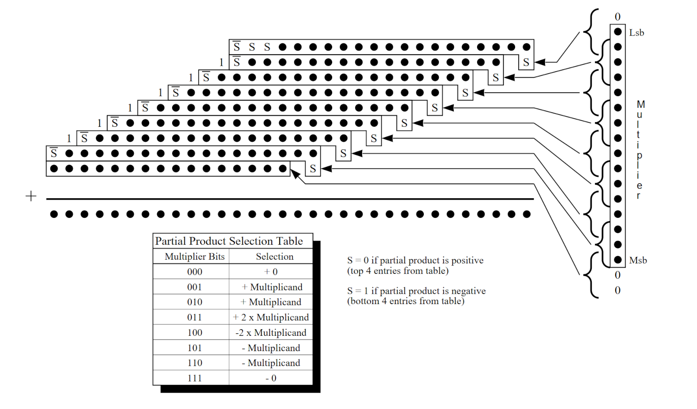

# How to run

To run the C++ program which generate a Dadda tree radix4 multiplier you have to run these commands
where #NUMBIT has to be replaced with the number of bit you choose for your architecture:
1. `make`
2. `./DaddaTreeGen #NUMBIT`

The intial dot scheme generated by `initColumns()` is the one shown in the following image:

